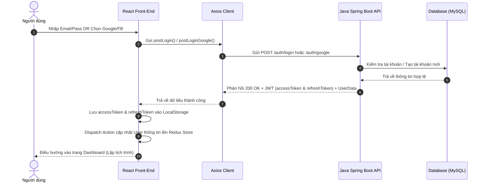
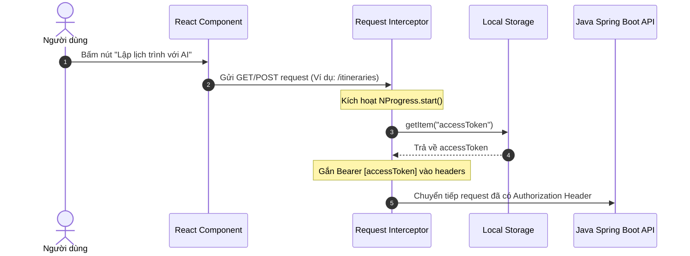
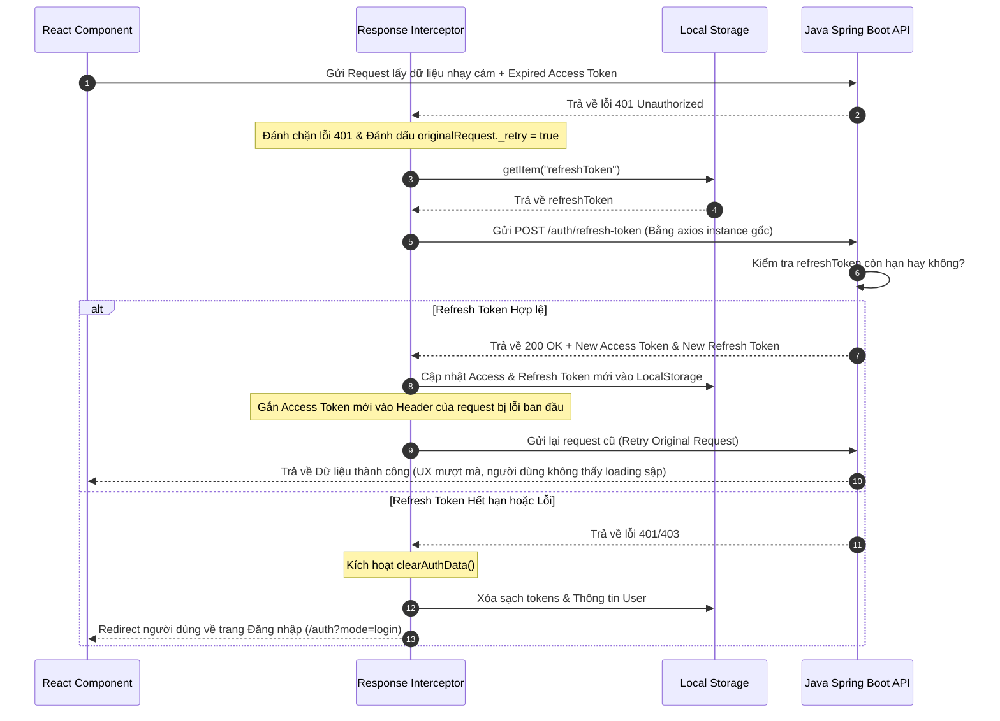
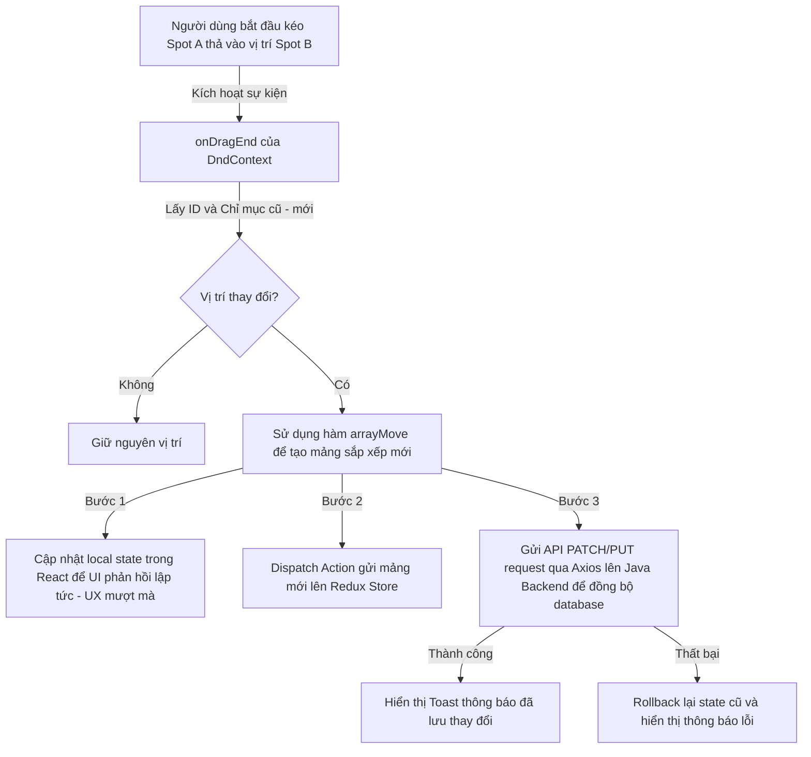

# 🎓 CẨM NANG BẢO VỆ ĐỒ ÁN - CÔNG NGHỆ FRONT-END (LOCALGO AI)

Tài liệu này được biên soạn đặc biệt cho thành viên **Nguyễn Quang Long** nhằm chuẩn bị cho buổi bảo vệ đồ án trước Hội đồng. Nội dung tập trung hoàn toàn vào **Kiến trúc Công nghệ Front-End**, các **quyết định kỹ thuật** và **bộ câu hỏi thực chiến** mà thầy cô phản biện thường xuyên đặt ra.

---

## 🗺️ PHẦN 1: BẢN ĐỒ CÔNG NGHỆ (TECH STACK OVERVIEW)
Khi thầy cô hỏi: **"Hệ thống Front-End của em sử dụng những công nghệ gì và tại sao lại chọn chúng?"**, hãy tự tin trình bày theo kịch bản nói cực kỳ mạch lạc và thuyết phục sau đây:

> *"Kính thưa Hội đồng, hệ thống Front-End của ứng dụng LocalGo AI được chúng em phát triển với kiến trúc Single Page Application hiện đại, được tối ưu hóa tối đa về hiệu năng tương tác và trải nghiệm người dùng. Cụ thể, sơ đồ công nghệ được phân chia rõ ràng theo các vai trò cốt lõi như sau:"*

1. **Về Thư viện Giao diện chính (Core UI Library)**:
   * Chúng em sử dụng **React 19** làm thư viện phát triển giao diện chính. Đây là phiên bản mới nhất giúp tối ưu hóa hiệu năng render thông qua Virtual DOM và hỗ trợ cơ chế quản lý Actions, Forms cực kỳ mạnh mẽ. Lựa chọn này giúp nhóm xây dựng các Component trực quan, dễ tái sử dụng và nhận được sự hỗ trợ từ cộng đồng lập trình cực kỳ lớn trên toàn cầu.

2. **Về Công cụ Xây dựng & Biên dịch (Build Tool & Bundler)**:
   * Nhóm quyết định lựa chọn **Vite 8** *(Beta)* làm Build Tool & Bundler thay vì Webpack truyền thống. Nhờ sử dụng bộ biên dịch `esbuild` viết bằng ngôn ngữ Go và cơ chế Native ESM (ES Modules), Vite mang lại tốc độ khởi động máy chủ ảo (dev server) và cập nhật thay đổi (Hot Module Replacement - HMR) gần như tức thì, giúp tăng tốc hiệu suất phát triển dự án lên gấp hàng chục lần.

3. **Về Ngôn ngữ lập trình chính (Language)**:
   * Toàn bộ mã nguồn phía Front-End được viết bằng **TypeScript**. Việc áp dụng TypeScript mang lại cơ chế định kiểu tĩnh (static typing), giúp nhóm phát hiện sớm đến 90% lỗi cú pháp ngay trong quá trình viết code (compile-time) thay vì đợi đến lúc chạy ứng dụng (run-time). Đồng thời, việc định nghĩa các Interface và Type rõ ràng giúp Front-End đồng bộ dữ liệu hoàn hảo với cấu trúc API từ Java Backend.

4. **Về Quản lý Trạng thái Toàn cục (State Management)**:
   * Chúng em tích hợp bộ đôi **Redux Toolkit & Redux Persist** để quản lý trạng thái tập trung và tin cậy duy nhất cho toàn bộ hệ thống (Single Source of Truth) như: thông tin cá nhân, trạng thái đăng nhập và lịch trình du lịch hiện tại. Đặc biệt, `Redux Persist` giúp tự động mã hóa và lưu trữ các trạng thái quan trọng vào `localStorage`, giúp duy trì phiên đăng nhập và bảo toàn dữ liệu làm việc của người dùng ngay cả khi họ tải lại trang (F5).

5. **Về Thiết kế Giao diện & Định kiểu (Styling)**:
   * Nhóm kết hợp giữa **Bootstrap 5 và SASS (`.scss`)**. **Bootstrap 5** cung cấp hệ thống lưới (Grid System) responsive hoàn chỉnh và các UI component cơ bản giúp dựng khung giao diện nhanh chóng. **SASS** cho phép viết CSS lồng nhau (nesting), khai báo biến và các mixin tái sử dụng, giúp nhóm dễ dàng tùy biến giao diện cao cấp và thiết kế các hiệu ứng mượt mà theo đúng triết lý thiết kế hiện đại.

6. **Về Hiệu ứng Hoạt hình & Chuyển động (Animations)**:
   * Để tạo ra một giao diện sinh động và cao cấp, nhóm sử dụng **Framer Motion và thư viện AOS**. Trong đó, **Framer Motion** chịu trách nhiệm xử lý các chuyển động phức tạp dựa trên mô hình vật lý động (spring physics) như hiệu ứng Parallax Hero Slider hay các pop-up tương tác. Thư viện **AOS** đảm nhận việc tạo hiệu ứng trượt xuất hiện của các phần tử khi người dùng cuộn trang (Scroll Reveal).

7. **Về Bản đồ Tương tác trực quan (Interactive Map)**:
   * Nhóm đã tự tích hợp bản đồ **Leaflet & React Leaflet** thay vì Google Maps. Đây là thư viện bản đồ mã nguồn mở cực kỳ nhẹ (chỉ khoảng 40KB), hoàn toàn miễn phí và không bị giới hạn quota truy vấn. Leaflet cho phép nhóm tự do tùy biến Marker bằng SVG/CSS, điều khiển góc nhìn và tọa độ GPS cực kỳ linh hoạt để hiển thị các vị trí điểm đến trực quan.

8. **Về Tính năng Kéo - Thả sắp xếp lịch trình (Drag & Drop)**:
   * Nhóm sử dụng thư viện **@dnd-kit** để xây dựng tính năng kéo thả thay đổi thứ tự địa điểm tham quan. Đây là thư viện kéo thả hiện đại nhất hiện nay dành cho React, hỗ trợ Accessibility (khả năng tiếp cận) xuất sắc, dung lượng nhẹ và tối ưu hóa hiệu năng render lại (re-render) cực tốt giúp thao tác kéo thả mượt mà 0ms trễ trên cả thiết bị di động.

9. **Về Gửi yêu cầu HTTP và gọi API (API Requests Client)**:
   * Nhóm sử dụng **Axios** thay vì hàm `fetch` mặc định của trình duyệt. Axios hỗ trợ cấu hình instance tập trung, tự động đính kèm Token JWT qua **Request Interceptors**, và xử lý lỗi tập trung qua **Response Interceptors**, giúp quản lý các kết nối API một cách an toàn và chuyên nghiệp nhất.


---


## 🔄 PHẦN 2: SƠ ĐỒ LUỒNG DỮ LIỆU FRONT-END

### 1. Luồng Đăng ký & Đăng nhập (Email & Social OAuth 2.0)
Hệ thống hỗ trợ 2 hình thức xác thực chính:
* **Đăng nhập bằng Email/Password**: Người dùng gửi thông tin đăng nhập trực tiếp qua `postLogin`. Backend kiểm tra mật khẩu đã được mã hóa Bcrypt và trả về mã JWT.
* **Đăng nhập bằng Google/Facebook OAuth**: Front-End dùng thư viện lấy `Access Token` của bên thứ ba, chuyển tiếp lên API `/auth/google` hoặc `/auth/facebook` để Backend kiểm tra chéo (verify) và cấp phát mã JWT tương ứng của hệ thống.



### 2. Luồng Axios Request Interceptor (Đính kèm Token & NProgress)
Mỗi khi gửi yêu cầu lên Backend, `AxiosCustomize.tsx` đóng vai trò "đánh chặn" đầu đi để tự động làm 2 việc:
1. **Hiển thị thanh tiến trình**: Gọi `NProgress.start()` để tạo hiệu ứng tải trang mượt mà ở trên cùng màn hình.
2. **Tự động đính kèm Token**: Lấy `accessToken` từ `LocalStorage` và gắn vào tiêu đề `Authorization: Bearer [token]` mà lập trình viên không cần đính kèm thủ công ở mỗi API.



### 3. Luồng Axios Response Interceptor (Xử lý lỗi 401 & Tự động Refresh Token ngầm)
> [!IMPORTANT]
> Đây là câu hỏi **"ăn điểm tuyệt đối"** trước Hội đồng. Khi `accessToken` hết hạn (thường là 15 phút), API sẽ trả về lỗi `401 Unauthorized`. Thay vì đá người dùng ra trang đăng nhập ngay lập tức (UX rất tệ), Axios Response Interceptor sẽ âm thầm gọi API `/auth/refresh-token` để lấy token mới và tiếp tục chạy lại request cũ hoàn toàn ngầm mà người dùng không hề hay biết!



### 2. Luồng Kéo-Thả Sắp xếp Lịch trình (Drag & Drop Flow)


---

## 💬 PHẦN 3: BỘ CÂU HỎI THỰC CHIẾN & CÂU TRẢ LỜI MẪU (Q&A)

### 📌 Nhóm 1: Câu hỏi về Core React, Vite & TypeScript

#### Q1: Tại sao nhóm lại lựa chọn React 19 và Vite cho dự án này thay vì các công cụ khác như Angular, Vue hay Next.js?
* **Trả lời chuẩn học thuật**:
  > *"Thưa thầy cô, nhóm lựa chọn **React** vì đây là thư viện xây dựng SPA (Single Page Application) tập trung vào luồng dữ liệu một chiều (one-way data binding) và cơ chế Virtual DOM, giúp tối ưu hiệu năng hiển thị giao diện động có tần suất cập nhật cao như ứng dụng quản lý lịch trình của chúng em. Nhóm áp dụng **React 19** để tận dụng các cải tiến mới về hiệu năng, quản lý tài nguyên bất đồng bộ và tối ưu hóa bộ nhớ."*
  >
  > *"Về công cụ build, nhóm chọn **Vite 8** thay vì Webpack truyền thống vì Vite sử dụng cơ chế Native ESM và trình biên dịch `esbuild` viết bằng Go. Điều này giúp tăng tốc độ khởi chạy server và HMR (Hot Module Replacement) nhanh gấp hàng chục lần so với Webpack, giúp nâng cao đáng kể năng suất phát triển phần mềm."*
  >
  > *"Nhóm chưa áp dụng **Next.js** trong giai đoạn này vì LocalGo AI tập trung chủ yếu vào phần Dashboard tương tác chuyên sâu của người dùng sau khi đăng nhập (Interactive Client App) hơn là các trang tĩnh cần tối ưu SEO ở phía Server (Server-Side Rendering)."*

#### Q2: Lợi ích của việc áp dụng TypeScript vào dự án là gì? Nó giúp giải quyết vấn đề gì thực tế so với JavaScript?
* **Trả lời chuẩn học thuật**:
  > *"TypeScript mang lại cơ chế **Static Typing (định kiểu tĩnh)** cho dự án. Trong các hệ thống lớn có sự phối hợp giữa nhiều thành viên và liên kết chặt chẽ với Backend (Java), TypeScript đóng vai trò cực kỳ quan trọng:*
  > 1. *Giúp phát hiện sớm các lỗi về kiểu dữ liệu (như truyền sai tham số, thuộc tính bị thiếu hoặc sai chính tả) ngay trong lúc code (compile-time) thay vì đợi đến lúc chạy ứng dụng (run-time).*
  > 2. *Tự động gợi ý code (IntelliSense) chuẩn xác, giúp nhóm hiểu rõ cấu trúc dữ liệu của từng đối tượng như `Destination`, `Itinerary`, `Spot`.*
  > 3. *Nhóm đã định nghĩa các `interface` và `type` tại thư mục `/types` để đồng bộ hoàn hảo với các DTO (Data Transfer Object) từ Java Backend, giúp hạn chế tối đa lỗi lệch cấu trúc API."*

#### Q3: Tại sao nhóm chọn SASS (.scss) kết hợp Bootstrap 5 thay vì Tailwind CSS?
* **Trả lời chuẩn học thuật**:
  > *"**Bootstrap 5** cung cấp hệ thống Grid vô cùng mạnh mẽ cùng bộ khung component chuẩn hóa, giúp xây dựng giao diện đáp ứng (Responsive) và nguyên mẫu ứng dụng cực kỳ nhanh chóng. Bên cạnh đó, **SASS** cho phép nhóm viết CSS lồng nhau (nesting), sử dụng các biến (variables) để quản lý mã màu đồng bộ, viết các hàm tái sử dụng (mixins) và tối ưu hóa CSS."*
  >
  > *"Mặc dù **Tailwind CSS** rất phổ biến, nhưng đối với một ứng dụng du lịch cao cấp đòi hỏi nhiều thành phần UI tùy biến sâu như thanh tìm kiếm tích hợp gợi ý AI (#Chill, #CheckInSốngẢo), bộ lọc phân loại dạng tab pills và hệ thống bản đồ số với Marker phân vùng màu sắc theo danh mục, việc sử dụng kết hợp Bootstrap và SASS mang lại sự cân bằng hoàn hảo. SASS giúp nhóm dễ dàng custom các class style độc lập cho bản đồ, sidebar cuộn và các hiệu ứng động mượt mà hơn Tailwind rất nhiều."*

---

### 📌 Nhóm 2: Câu hỏi về Quản lý trạng thái & API (Redux & Axios)

#### Q4: Redux Toolkit đóng vai trò gì trong ứng dụng? Tại sao không dùng Context API của React cho đơn giản?
* **Trả lời chuẩn học thuật**:
  > *"Trong LocalGo AI, **Redux Toolkit** đóng vai trò là **Single Source of Truth (Nguồn dữ liệu tin cậy duy nhất)**, quản lý toàn bộ các trạng thái toàn cục ảnh hưởng tới nhiều trang như: trạng thái đăng nhập của người dùng, thông tin cá nhân, danh sách lịch trình đang chỉnh sửa."*
  >
  > *"Chúng em không sử dụng **Context API** cho các trạng thái phức tạp này vì cơ chế hoạt động của Context API khi một giá trị thay đổi sẽ buộc toàn bộ các component con tiêu thụ Context đó phải Re-render (tải lại), gây ảnh hưởng nghiêm trọng tới hiệu năng khi ứng dụng mở rộng. Redux Toolkit kết hợp với `useSelector` sử dụng cơ chế so sánh nông (shallow equality check), chỉ cho phép re-render đúng component đăng ký nhận dữ liệu thay đổi. Đồng thời, Redux cung cấp bộ công cụ debug mạnh mẽ (Redux DevTools) giúp nhóm dễ dàng theo dõi dòng chảy của trạng thái qua từng hành động (action) cụ thể."*

#### Q5: Redux Persist được sử dụng để làm gì và cơ chế hoạt động của nó như thế nào?
* **Trả lời chuẩn học thuật**:
  > *"Thưa thầy cô, thông thường khi người dùng tải lại trang (F5) hoặc đóng trình duyệt, toàn bộ trạng thái lưu trong bộ nhớ RAM của Redux Store sẽ bị xóa sạch, đồng nghĩa với việc người dùng bị đăng xuất hoặc mất dữ liệu đang làm việc dở dang. Để giải quyết vấn đề này, nhóm tích hợp **Redux Persist**."*
  >
  > *"Cơ chế hoạt động của nó như sau: Mỗi khi Redux Store có sự thay đổi về state (như đăng nhập thành công nhận Token), Redux Persist sẽ can thiệp (middleware), tự động chuyển đổi state đó thành chuỗi JSON và lưu trữ vào `localStorage` (hoặc `sessionStorage`). Khi ứng dụng được khởi chạy lại (Rehydrate), Redux Persist sẽ đọc chuỗi JSON từ trình duyệt, giải mã ngược lại và nạp đầy vào Redux Store trước khi giao diện người dùng được hiển thị, giúp duy trì phiên làm việc mượt mà."*

#### Q6: Axios Interceptors hoạt động như thế nào và tại sao lại sử dụng nó thay vì hàm fetch mặc định?
* **Trả lời chuẩn học thuật**:
  > *"**Axios** vượt trội hơn hàm `fetch` mặc định ở chỗ hỗ trợ cơ chế **Interceptors (bộ đánh chặn)** cho cả đầu gửi (Request) và đầu nhận (Response):"*
  > 1. ***Request Interceptor**: Trước khi bất kỳ yêu cầu nào được gửi lên Java Backend, Axios sẽ tự động chặn lại, lấy mã token `accessToken` từ `LocalStorage` và đính kèm vào phần tiêu đề `Authorization: Bearer [token]`. Việc này giúp loại bỏ hoàn toàn việc đính kèm token thủ công ở từng hàm gọi API trong hệ thống, đảm bảo mã nguồn gọn gàng và dễ bảo trì.*
  > 2. ***Response Interceptor**: Khi Backend phản hồi về, nếu thành công thì tiếp tục trả dữ liệu. Nếu phát hiện lỗi hoặc Token hết hạn, Interceptor sẽ đóng vai trò xử lý lỗi tập trung (Global Error Handling), ví dụ tự động đăng xuất người dùng nếu token không thể phục hồi, thay vì để ứng dụng bị lỗi cục bộ tại từng trang."*

#### Q6.1: Em hãy giải thích cơ chế làm mới Token tự động (Silent Token Refresh Flow) được cài đặt trong Axios của nhóm hoạt động ra sao khi gặp lỗi 401?
* **Trả lời chuẩn học thuật**:
  > *"Thành công lớn nhất trong cơ chế bảo mật Front-End của nhóm là triển khai **luồng làm mới Token ngầm (Silent Refresh)** để tăng cường trải nghiệm người dùng (UX):"*
  > 1. *Khi một API gửi đi nhận phản hồi mã lỗi `401 Unauthorized` từ Backend (do `accessToken` đã hết hạn sau 15 phút), **Axios Response Interceptor** sẽ lập tức đánh chặn lỗi này.*
  > 2. *Nó kiểm tra xem request này đã thử gửi lại chưa (`!originalRequest._retry`). Nếu chưa, nó sẽ đánh dấu là đã thử (`originalRequest._retry = true`), sau đó lấy `refreshToken` từ `LocalStorage` ra.*
  > 3. *Tiếp theo, Interceptor sử dụng **instance Axios gốc** (để tránh lặp vô tận interceptor) để gửi yêu cầu POST đến API `/auth/refresh-token` với dữ liệu `refreshToken` tương ứng.*
  > 4. *Nếu Backend xác nhận `refreshToken` vẫn hợp lệ, nó sẽ trả về cặp Token mới. Chúng em lập tức lưu `accessToken` và `refreshToken` mới vào `LocalStorage`, cập nhật lại tiêu đề `Authorization` của yêu cầu cũ, và gọi lại yêu cầu bị lỗi ban đầu bằng `instance(originalRequest)`.*
  > 5. *Người dùng sẽ nhận lại dữ liệu thành công mà hoàn toàn **không hề hay biết** là Token vừa bị hết hạn và đã được làm mới ngầm (không phải đăng nhập lại, không hiện loading sập trang).*
  > 6. *Trường hợp `refreshToken` cũng đã hết hạn (sau nhiều ngày không sử dụng), hệ thống sẽ tự động dọn dẹp dữ liệu bằng `clearAuthData()` và điều hướng người dùng ra trang Đăng nhập."*

#### Q6.2: Quy trình đăng ký, đăng nhập và tích hợp mạng xã hội (Google & Facebook OAuth) của nhóm diễn ra như thế nào?
* **Trả lời chuẩn học thuật**:
  > *"Quy trình xác thực được chúng em xây dựng chặt chẽ theo chuẩn OAuth 2.0 phối hợp an toàn giữa Client và Server:*
  > - ***Đăng ký & Đăng nhập truyền thống**: Người dùng điền Form. Hàm `postSignUp` hoặc `postLogin` sẽ gửi yêu cầu POST chứa email, mật khẩu lên API `/auth/register` hoặc `/auth/login`. Backend tiến hành xác thực, mã hóa và trả về cặp JWT Token cùng thông tin User.*
  > - ***Đăng nhập bằng Google & Facebook**: Chúng em sử dụng thư viện `@react-oauth/google` và `@greatsumini/react-facebook-login` hiển thị giao diện pop-up chuẩn của Google/FB. Khi người dùng xác thực thành công ở pop-up, Google/FB trả về cho client một `Credential/Access Token`. Chúng em truyền token này lên API `/auth/google` hoặc `/auth/facebook` để Java Backend tự kiểm tra chéo (verify) với server Google/FB. Nếu hợp lệ, Backend sẽ đăng ký tài khoản (nếu chưa có) và trả về JWT Token của hệ thống.*
  > - ***Đồng bộ lưu trữ**: Sau khi API xác thực thành công, Front-End lập tức lưu `accessToken` và `refreshToken` vào `LocalStorage` để Axios Interceptor sử dụng, đồng thời Dispatch Action cập nhật thông tin cá nhân của User lên Redux Store để hiển thị Avatar, tên người dùng đồng bộ trên thanh Navbar toàn cục."*

---

### 📌 Nhóm 3: Câu hỏi về Các tính năng tương tác đặc biệt (Maps, Dnd, Carousel)

#### Q7: Tại sao nhóm lại chọn thư viện Leaflet thay vì Google Maps? Cách đồng bộ tọa độ từ Bản đồ Leaflet sang các component khác như thế nào?
* **Trả lời chuẩn học thuật**:
  > *"Nhóm lựa chọn **Leaflet** kết hợp với **React Leaflet** dựa trên 3 tiêu chí:*
  > 1. ***Hiệu năng & Kích thước**: Leaflet rất nhẹ (~40KB), giúp tối ưu hóa thời gian tải trang ban đầu (TBT, LCP) của ứng dụng.*
  > 2. ***Chi phí**: Hoàn toàn miễn phí và mã nguồn mở. Google Maps yêu cầu thông tin thẻ tín dụng và tính phí rất đắt khi vượt giới hạn lượt truy cập.*
  > 3. ***Khả năng tùy biến**: Dễ dàng vẽ Marker tùy biến theo từng loại dịch vụ bằng mã màu CSS (như màu cam cho ăn uống, màu xanh dương cho khách sạn) và hỗ trợ tích hợp mượt mà dưới dạng các Component React.*
  >
  > *"Để đồng bộ tọa độ:*
  > *Chúng em sử dụng một state chung `activeCoordinate` hoặc `selectedLocation`. Khi người dùng click vào một địa điểm ở danh sách bên trái hoặc click trực tiếp vào Marker trên bản đồ Leaflet, một callback function sẽ cập nhật state này. Bản đồ sẽ sử dụng component con `<MapController>` lắng nghe state thay đổi để tự động thực hiện hiệu ứng di chuyển camera và zoom (`map.setView` hoặc `map.flyTo`) đến đúng vị trí của tọa độ đó."*

#### Q8: Hãy giải thích kỹ thuật kéo thả sắp xếp lịch trình bằng `@dnd-kit`. Làm thế nào để đảm bảo UI hiển thị mượt mà mà không bị trễ (lag) khi kéo thả?
* **Trả lời chuẩn học thuật**:
  > *"Để xây dựng tính năng kéo thả thay đổi thứ tự địa điểm tham quan trong ngày, nhóm sử dụng thư viện **@dnd-kit/core** và **@dnd-kit/sortable**. Chúng em bọc danh sách các Spot bằng `<DndContext>` và `<SortableContext>` với chiến thuật sắp xếp theo trục dọc (vertical list). Quy trình diễn ra như sau:*
  > 1. *Khi người dùng kéo một phần tử, thư viện sẽ tính toán vị trí động và áp dụng các thuộc tính CSS Transform (`translate3d`) lên phần tử đó để hiển thị hoạt ảnh kéo thời gian thực.*
  > 2. *Khi sự kiện thả xảy ra (`onDragEnd`), nhóm trích xuất ID của phần tử nguồn (active) và phần tử đích (over). Sử dụng hàm tiện ích `arrayMove` của thư viện để đổi chỗ 2 phần tử trong mảng dữ liệu.*
  > 3. ***Tối ưu hóa hiệu năng (UX mượt mà)**: Thay vì đợi Backend phản hồi mới cập nhật giao diện, nhóm áp dụng kỹ thuật **Optimistic UI (Cập nhật lạc quan)**. Chúng em lập tức cập nhật local state của React để giao diện người dùng thay đổi ngay lập tức (0ms trễ). Song song với đó, một request API bất đồng bộ sẽ âm thầm gửi mảng thứ tự mới lên Backend để lưu vào cơ sở dữ liệu. Nếu API thất bại (hiếm khi xảy ra), ứng dụng mới thực hiện Rollback (khôi phục) lại trật tự cũ và báo lỗi cho người dùng."*

#### Q9: Hãy giải thích cách thức hoạt động và tính đồng bộ của Hệ thống Bộ lọc Đa chiều (Multi-dimensional Filter) kết hợp Bản đồ số Leaflet.
* **Trả lời chuẩn học thuật**:
  > *"Bộ lọc trên trang Khám phá của chúng em được xây dựng với cấu trúc lọc sâu 4 lớp, được quản lý tập trung thông qua React State và đồng bộ thời gian thực (Real-time Sync) với Bản đồ Leaflet:*
  > 1. ***Quản lý State Lọc**: Nhóm khai báo một đối tượng state tổng hợp `filterState` chứa các trường: `category` (tab pills), `searchQuery` (input), `region` (khu vực), `subCategory` (danh mục chi tiết), `priceRange` (mức giá) và `tags` (mảng từ khóa gợi ý AI).*
  > 2. ***Đồng bộ thời gian thực với Bản đồ**: Khi người dùng thay đổi bất kỳ bộ lọc nào, React sẽ tự động lọc danh sách địa điểm gốc. Mảng dữ liệu đã lọc này được truyền thẳng vào Component `<MapContainer />`. Bản đồ Leaflet sẽ tự động re-render, xóa các Marker cũ và vẽ lại các Marker mới tương ứng.*
  > 3. ***Mã hóa màu sắc Marker (Color-coded Markers)**: Chúng em custom các Marker Icon bằng Leaflet SVG DivIcon. Mỗi Marker sẽ nhận một class CSS có màu nền đặc thù tùy theo danh mục (như màu cam cho Ẩm thực, màu xanh dương cho Khách sạn, màu xanh lá cho Điểm tham quan). Lớp ghi chú (Legend) ở góc bản đồ giúp người dùng nhận diện nhanh phân loại.*
  > 4. ***Gợi ý từ khóa AI**: Khi click vào các gợi ý tag như #Chill hay #CheckInSốngẢo, hệ thống sẽ chèn tag đó vào bộ lọc, lập tức kích hoạt hàm lọc và cập nhật lại danh sách điểm đến cũng như bản đồ, mang lại trải nghiệm tìm kiếm cực kỳ linh hoạt và hiện đại."*

#### Q10: Tại sao ở trang Khám phá, danh sách địa điểm bên trái được phân trang (9 mục/trang) nhưng Bản đồ Leaflet bên phải lại hiển thị tất cả các Marker thỏa mãn? Nhóm tối ưu hóa hiệu năng render bản đồ như thế nào?
* **Trả lời chuẩn học thuật**:
  > *"Đây là một quyết định thiết kế chiến lược của nhóm nhằm tối ưu hóa đồng thời cả Trải nghiệm người dùng (UX) và Hiệu năng hệ thống (Performance):*
  > 1. ***Về mặt UX**: Danh sách thẻ bên trái hiển thị đầy đủ thông tin chi tiết (hình ảnh, tên, mô tả, đánh giá, giá cả) nên chiếm rất nhiều diện tích màn hình. Nếu hiển thị toàn bộ hàng chục hoặc hàng trăm địa điểm cùng một lúc, người dùng sẽ gặp tình trạng 'quá tải thông tin' (cognitive overload) và phải cuộn chuột rất nhiều. Phân trang (9 mục/trang) giúp giao diện gọn gàng và dễ theo dõi. Ngược lại, bản đồ biểu diễn không gian địa lý, người dùng cần nhìn thấy toàn bộ các điểm khớp bộ lọc để dễ so sánh khoảng cách và lộ trình. Do đó bản đồ phải hiển thị đầy đủ kết quả.*
  > 2. ***Về mặt Kỹ thuật & Hiệu năng**:*
  >    - *Danh sách thẻ bên trái sử dụng `displayedData` đã được cắt nhỏ theo trang thông qua hàm `.slice()` của JS.*
  >    - *Bản đồ Leaflet nhận biến `filteredData` chứa toàn bộ danh sách kết quả sau lọc để ghim đầy đủ Marker.*
  >    - *Để tối ưu hiệu năng render bản đồ khi số lượng dữ liệu lớn (tránh làm lag trình duyệt do render quá nhiều DOM Node), nhóm sử dụng các Marker SVG DivIcon gọn nhẹ. Trong trường hợp dữ liệu thương mại phình to hơn (hàng ngàn điểm), nhóm đề xuất giải pháp tích hợp **Marker Clustering (nhóm các điểm gần nhau thành cụm số)** để tối ưu dung lượng RAM và giữ bản đồ trực quan."*

#### Q11: Hãy giải thích cách thiết kế và cơ chế lưu trữ lịch sử trò chuyện (Chat Session Persistence) của trợ lý ảo TravelAi. Làm thế nào hệ thống đồng bộ hóa và quản lý các phiên chat theo từng lộ trình cụ thể?
* **Trả lời chuẩn học thuật**:
  > *"Hệ thống trợ lý ảo TravelAi của chúng em hỗ trợ tính năng **Lưu giữ phiên trò chuyện bền vững (Persistent Chat Sessions)** cả ở cơ sở dữ liệu lẫn giao diện Front-End:*
  > 1. ***Liên kết thực thể**: Mỗi cuộc hội thoại được đại diện bởi một thực thể `ChatSession` lưu trữ trên database Backend, được liên kết trực tiếp với `userId` để bảo mật và optionally gắn với một `itineraryId` (lộ trình cụ thể) để duy trì ngữ cảnh.*
  > 2. ***Tải danh sách phiên chat**: Chúng em tích hợp API `/chatbot-rag/sessions/my-sessions` qua [chatbotService.ts](file:///d:/doan/TravelAi/Fe/src/services/chatbotService.ts#L53). Tại giao diện `<AIChatBox>`, người dùng có thể nhấp vào biểu tượng `ClockCounterClockwise` (Lịch sử) để mở một danh sách lịch sử trò chuyện trực quan (nhận biết được tên lộ trình tương ứng nhờ hàm liên kết `getItineraryTitle`).*
  > 3. ***Khôi phục cuộc hội thoại**: Khi người dùng click vào một phiên cũ, Front-End gửi yêu cầu đến API `/chatbot-rag/sessions/{sessionId}/messages` để tải về toàn bộ mảng tin nhắn RAG (`RAGMessageResponse[]`). Giao diện sẽ tự động re-render và khôi phục toàn bộ nội dung chat cũ lên màn hình.*
  > 4. ***Xóa và cập nhật Reactive**: Người dùng có thể xóa phiên chat cũ (gửi yêu cầu DELETE đến Backend), Front-End ngay lập tức cập nhật lại state của mảng để biến mất khỏi giao diện mà không cần reload trang.*
  > 5. ***Context-aware RAG**: Việc gắn phiên chat với lộ trình giúp mô hình AI RAG phía Backend luôn nắm giữ được ngữ cảnh chuyến đi của du khách, từ đó đưa ra câu trả lời tư vấn chính xác và tối ưu nhất."*

---

### 📌 Nhóm 4: Câu hỏi về Xác thực & Bảo mật (Security & OAuth)

#### Q12: Cơ chế đăng nhập bằng mạng xã hội (Google & Facebook OAuth) hoạt động ở Front-End ra sao?
* **Trả lời chuẩn học thuật**:
  > *"Chúng em triển khai quy trình xác thực OAuth 2.0 theo mô hình kết hợp FE-BE an toàn:*
  > 1. *Ở Front-End, nhóm sử dụng thư viện `@react-oauth/google` và `@greatsumini/react-facebook-login` để hiển thị nút đăng nhập chuẩn hóa.*
  > 2. *Khi người dùng click và xác thực thành công trên pop-up của Google/Facebook, các nhà cung cấp này sẽ trả về cho Front-End một mã thông báo gọi là `Credential/Access Token`.*
  > 3. *Front-End **không** dùng token này trực tiếp để đăng nhập, mà ngay lập tức gửi một yêu cầu API chuyển tiếp token này lên Java Spring Boot Backend.*
  > 4. *Backend sẽ sử dụng thư viện của Google/Facebook để kiểm tra chéo (verify) tính hợp lệ của token này ở server-side. Nếu hợp lệ, Backend sẽ tiến hành đăng ký/đăng nhập người dùng trong database, sau đó phát hành ra một mã **JWT (JSON Web Token) riêng của hệ thống chúng em** và trả về cho Front-End.*
  > 5. *Front-End nhận JWT này, lưu trữ vào Redux Store để sử dụng cho các phiên làm việc tiếp theo. Quy trình này đảm bảo an toàn tuyệt đối vì tránh lộ lọt thông tin nhạy cảm của người dùng ở client-side."*

#### Q13: Nhóm bảo mật các đường dẫn (Route) dành riêng cho người dùng đã đăng nhập hoặc Admin như thế nào?
* **Trả lời chuẩn học thuật**:
  > *"Nhóm xây dựng một component bảo vệ đặc biệt gọi là `ProtectedRoute` (hoặc `PrivateRoute`) bọc ngoài các trang nhạy cảm như Planner, Profile, Admin Dashboard. Component này sẽ đọc thông tin trạng thái xác thực `isAuthenticated` và quyền truy cập `role` từ Redux Store:*
  > - *Nếu người dùng chưa đăng nhập, `ProtectedRoute` sẽ tự động chuyển hướng (Redirect) họ về trang chủ và hiển thị Modal Đăng nhập.*
  > - *Nếu người dùng đã đăng nhập nhưng không đủ quyền hạn (ví dụ: User thường cố gắng truy cập `/admin`), component sẽ điều hướng họ sang trang báo lỗi 403 Forbidden.*
  > - *Chỉ khi thỏa mãn đầy đủ các điều kiện xác thực và quyền hạn, component con (`<Outlet />`) mới được render để hiển thị nội dung."*

---

### 📌 Nhóm 5: Câu hỏi về Tối ưu hóa hiệu năng, Responsive & SEO

#### Q12: Ứng dụng tải rất nhiều hình ảnh chất lượng cao và bản đồ nặng, nhóm đã làm thế nào để tối ưu hóa hiệu năng tải trang?
* **Trả lời chuẩn học thuật**:
  > *"Để đảm bảo chỉ số hiệu năng đạt điểm số tối ưu nhất, nhóm đã áp dụng đồng bộ các giải pháp sau:*
  > 1. ***Code Splitting (Phân tách mã nguồn)**: Sử dụng cơ chế `React.lazy` kết hợp `<Suspense>` để chia nhỏ bundle chính của ứng dụng thành các bundle nhỏ theo từng route. Người dùng truy cập trang nào trình duyệt mới tải mã nguồn của trang đó, giúp giảm 60% kích thước file Javascript tải lần đầu.*
  > 2. ***Image & Media Optimization**: Toàn bộ video nền trên trang chủ đều được chuyển đổi sang định dạng nén `.webm` và `.mp4` dung lượng thấp dưới 5MB. Nhóm áp dụng thuộc tính `loading="lazy"` cho hình ảnh để trình duyệt chỉ tải ảnh khi chúng chuẩn bị xuất hiện trên khung hình của người dùng.*
  > 3. ***Caching & State Persistence**: Tận dụng bộ nhớ đệm và hạn chế tối đa các lượt gọi API thừa thông qua cơ chế lưu trữ cục bộ.*
  > 4. ***NProgress**: Tích hợp thanh tiến trình tải trang siêu nhẹ ở trên cùng màn hình để tạo cảm giác phản hồi nhanh chóng cho người dùng khi di chuyển giữa các route."*

#### Q13: Các em thiết kế giao diện Responsive như thế nào? Thiết bị di động có gặp trở ngại gì khi hiển thị bản đồ hoặc kéo thả không?
* **Trả lời chuẩn học thuật**:
  > *"Nhóm thiết kế theo nguyên lý **Mobile-First** (thiết kế ưu tiên di động) kết hợp hệ thống lưới Responsive của **Bootstrap 5 (breakpoints: sm, md, lg, xl)** và các custom media queries trong **SASS**:*
  > - *Đối với bản đồ Leaflet: Trên màn hình máy tính, danh sách địa điểm và bản đồ hiển thị song song ở 2 cột. Trên màn hình di động, chúng em chuyển sang dạng Tab hoặc hiển thị bản đồ tràn màn hình với nút thu gọn danh sách để tối ưu không gian hiển thị hạn chế.*
  > - *Đối với tính năng kéo thả: Thư viện `@dnd-kit` hỗ trợ cực kỳ xuất sắc các sự kiện cảm ứng (Touch Sensors). Chúng em cấu hình cảm biến nhận diện chạm với độ trễ nhỏ (`delay: 150ms` hoặc `distance: 5px`) để khi người dùng cuộn trang trên điện thoại, hệ thống không bị nhầm lẫn giữa hành động cuộn màn hình và hành động kéo thả Spot."*

#### Q14: Là một SPA (Single Page Application), ứng dụng này gặp nhược điểm gì về SEO và nhóm đề xuất giải pháp khắc phục thế nào?
* **Trả lời chuẩn học thuật**:
  > *"Nhược điểm cố hữu của SPA là toàn bộ nội dung trang được render bằng Javascript ở client-side, do đó các robot tìm kiếm của Google hay Bing khi cào dữ liệu thô (raw HTML) sẽ chỉ thấy một trang trắng trống rỗng, làm giảm thứ hạng SEO.*
  > *Để giải quyết vấn đề này trong thực tế:*
  > 1. *Nhóm đã tối ưu hóa cấu trúc mã nguồn bằng cách sử dụng **HTML5 Semantic Elements** (như `<header>`, `<main>`, `<section>`, `<footer>`) để robot dễ phân tích cấu trúc.*
  > 2. *Đảm bảo thuộc tính `alt` cho tất cả hình ảnh và `aria-label` cho các phần tử tương tác để hỗ trợ tối đa khả năng tiếp cận (Accessibility).*
  > 3. ***Giải pháp dài hạn**: Nếu đưa dự án vào thương mại hóa thực tế, nhóm đề xuất chuyển đổi các trang công cộng cần SEO (như trang Trang chủ, trang Khám phá, Tin tức) sang kiến trúc **Next.js (Server-Side Rendering - SSR)**, trong khi các trang quản lý và Dashboard nội bộ phức tạp vẫn giữ nguyên cấu trúc React SPA hiện tại để tiết kiệm chi phí vận hành server."*

---

## ⚡ PHẦN 4: TỐI ƯU HÓA CHUYỂN TAB KHÔNG LOAD LẠI DỮ LIỆU (TAB CACHING STRATEGIES)

Khi thầy cô phản biện hỏi: **"Làm thế nào để khi người dùng chuyển đổi qua lại giữa các tab trên giao diện không bị load lại dữ liệu (chống re-fetching/re-mounting)?"**, hãy trình bày 3 phương án tối ưu chiến lược sau:

### 1. Phương án A: Giữ Component trong DOM bằng CSS (`display: none` / `block`)
* **Bản chất kỹ thuật**: Thay vì dùng conditional rendering `{activeTab === 'info' && <InfoTab />}` (khiến tab cũ bị unmount/hủy bỏ và reset hết state), ta luôn giữ tất cả các tab trong DOM nhưng sử dụng CSS `display` để ẩn/hiện chúng đi.
* **Code mẫu thực tế**:
  ```tsx
  <div style={{ display: activeTab === "info" ? "block" : "none" }}>
    <InfoTab />
  </div>
  <div style={{ display: activeTab === "password" ? "block" : "none" }}>
    <PasswordTab />
  </div>
  ```
* **Ưu thế**: Cực kỳ dễ triển khai, giữ lại nguyên vẹn local state (như các trường dữ liệu người dùng đang nhập dở trên form) mà không cần đưa lên Global Store.
* **Áp dụng**: Trang **Thông tin cá nhân (Profile)** hoặc trang **Chi tiết điểm đến (DestinationDetail)**.

### 2. Phương án B: Tạo cơ chế lưu Cache dữ liệu theo Tab ở Component cha (Local Object Caching)
* **Bản chất kỹ thuật**: Thay vì chỉ dùng một biến state duy nhất làm dữ liệu bị ghi đè khi đổi tab, ta khai báo một Object state đóng vai trò làm bộ nhớ đệm (Cache) lưu trữ theo `key` là tên hoặc ID của tab.
* **Code mẫu thực tế (Trang Tin Tức - News.tsx)**:
  ```tsx
  const [newsCache, setNewsCache] = useState<Record<string, NewsItem[]>>({});
  const [newsData, setNewsData] = useState<NewsItem[]>([]);

  useEffect(() => {
    // Nếu cache đã có sẵn dữ liệu của tab hiện tại thì sử dụng luôn
    if (newsCache[activeTab]) {
      setNewsData(newsCache[activeTab]);
      return; // Ngăn chặn việc hiển thị loading và gọi lại API trùng lặp
    }

    const fetchNews = async () => {
      setIsLoading(true);
      const res = await getNewsList(activeTab);
      const fetchedData = res.data.data;
      setNewsData(fetchedData);
      // Lưu trữ dữ liệu mới tải vào cache
      setNewsCache(prev => ({ ...prev, [activeTab]: fetchedData }));
      setIsLoading(false);
    };
    fetchNews();
  }, [activeTab]);
  ```
* **Ưu thế**: Tránh gọi API trùng lặp, tốc độ phản hồi chuyển tab cực nhanh (0ms), giữ code gọn nhẹ mà không cần setup Redux phức tạp.
* **Áp dụng**: Trang **Tin Tức (News)** hoặc trang **Khám Phá (Explore)** khi dùng chung một Grid Component nhưng lọc theo danh mục khác nhau.

### 3. Phương án C: Đưa dữ liệu lên Redux Store hoặc sử dụng RTK Query
* **Bản chất kỹ thuật**: Lưu dữ liệu của mỗi tab vào Redux Store toàn cục. Khi component bị unmount, dữ liệu trong Store vẫn được bảo toàn.
  * **Redux Store**: Khi quay lại tab, component lấy dữ liệu từ Redux ra vẽ lên màn hình tức thì, đồng thời gọi API chạy ngầm (background fetch) để làm mới dữ liệu mà không gây ngắt quãng trải nghiệm (không xoay loading).
  * **RTK Query (Redux Toolkit Query)**: Tự động hóa hoàn toàn việc cache dữ liệu thông qua cơ chế tự động theo dõi tham số (Query Params). Cấu hình giữ cache thông minh qua trường `keepUnusedDataFor: 300` (giữ cache trong 5 phút).
* **Ưu thế**: Chuẩn mực công nghiệp cho dự án lớn, dữ liệu đồng bộ toàn hệ thống, tự động quản lý vòng đời bộ nhớ đệm.
* **Áp dụng**: Các trang Dashboard phức tạp, dữ liệu lịch trình hoặc thông tin yêu thích cần chia sẻ cho nhiều page khác nhau.

---

## 💡 PHẦN 5: MẸO VÀNG KHI TRẢ LỜI TRƯỚC HỘI ĐỒNG (TÂM LÝ & PHONG THÁI)

1. **Thái độ Tôn trọng & Cầu thị**:
   * Khi thầy cô đặt câu hỏi, hãy luôn ghi chép lại vào sổ hoặc giấy. Đợi thầy cô hỏi xong mới trả lời, tuyệt đối không cướp lời.
   * Luôn bắt đầu câu trả lời bằng: *"Dạ em cảm ơn câu hỏi của Thầy/Cô, về vấn đề này nhóm chúng em xin phép được trình bày như sau..."*

2. **Cách ứng phó khi gặp câu hỏi "Bí" (Không biết câu trả lời)**:
   * **Tuyệt đối KHÔNG**: Nói bừa, đoán mò hoặc im lặng quá lâu.
   * **Nên trả lời**: *"Dạ thưa Thầy/Cô, câu hỏi của Thầy/Cô rất hay và chuyên sâu. Thực sự trong quá trình nghiên cứu và phát triển đồ án này, nhóm chúng em chưa lường hết hoặc chưa có điều kiện nghiên cứu kỹ phần này do giới hạn về thời gian. Chúng em rất mong nhận được sự chỉ dẫn của Thầy/Cô và chắc chắn sẽ tìm hiểu kỹ lưỡng nội dung này ngay sau buổi bảo vệ hôm nay để hoàn thiện sản phẩm ạ."* -> *Hội đồng cực kỳ đánh giá cao câu trả lời cầu thị này.*

3. **Biết cách "Khoe" điểm mạnh**:
   * Khi trả lời về giao diện hoặc các tính năng, hãy chủ động liên hệ trực tiếp với các tính năng xuất sắc nhóm đã làm như: **Bản đồ Leaflet có phân màu Marker**, **Tính năng kéo thả sắp xếp lịch trình mượt mà bằng @dnd-kit**, **Hệ thống bộ lọc đa chiều đồng bộ thời gian thực với bản đồ**.
   * Hãy nhấn mạnh: *"Đây là những tính năng khó, đòi hỏi tính tương tác rất cao và nhóm đã tự nghiên cứu, phát triển hoàn chỉnh từ đầu thay vì chỉ dùng các thư viện mẫu có sẵn trên mạng."*

---

> [!TIP]
> **Lời khuyên cho Nguyễn Quang Long**: Hãy mở file này lên trình duyệt hoặc in ra giấy. Đọc qua 2-3 lần trước ngày bảo vệ. Sự chuẩn bị kỹ càng về mặt lý thuyết công nghệ sẽ giúp bạn tự tin tuyệt đối trước mọi câu hỏi phản biện của hội đồng! Chúc bạn bảo vệ đồ án thành công xuất sắc! 🚀

---
*Tài liệu được chuẩn bị tự động bởi trợ lý AI Antigravity phục vụ dự án LocalGo AI.*
